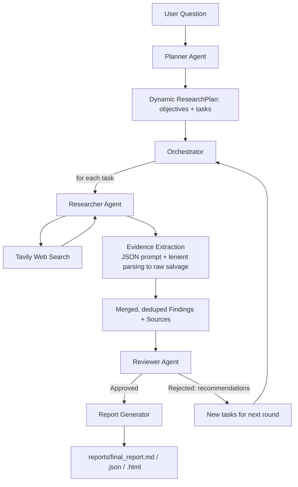

# Autonomous Research Agent

A production-quality, general-purpose autonomous research system. Give it
**any** research question and it will plan, search the web, extract
evidence, review its own work, refine itself, and produce a polished
final report — with no hardcoded topic logic anywhere in the pipeline.

## Overview

You give the system a question. It:

1. **Plans** a set of research tasks specific to that question (Planner).
2. **Researches** each task autonomously — deciding its own search
   queries, calling Tavily, and extracting structured, source-backed
   findings (Researcher).
3. **Reviews** the combined findings for relevance, evidence quality,
   source quality, completeness, consistency, specificity, verification,
   and freshness (Reviewer).
4. **Refines** — if the review isn't good enough, the Reviewer's specific
   recommendations become a new round of research tasks, and the cycle
   repeats (bounded by round and search-budget limits). Nothing from an
   earlier round is thrown away.
5. **Reports** — generates `reports/final_report.md`, `.json`, and
   `.html`, with an LLM-authored narrative that adapts its structure to
   the question (comparison tables, timelines, thematic sections, etc.)
   layered over deterministic sources/methodology/limitations sections.

## Features

- Fully dynamic task decomposition — no hardcoded task lists, ever, in
  any code path (including failure fallbacks).
- Autonomous multi-search researcher with duplicate-query avoidance
  across the entire run (not just per task).
- Layered, crash-proof evidence extraction (JSON-prompt extraction with
  lenient per-item validation → raw-evidence salvage) so a formatting
  failure never erases evidence that was actually collected.
- Reviewer-driven refinement: rejected research turns into new,
  standalone tasks built directly from the Reviewer's recommendations.
- Cumulative evidence across rounds, deduplicated by URL+claim.
- Centralized configuration (`config/settings.py`) — one place to change
  the model or any limit.
- Retries with exponential backoff + jitter for transient local-server
  errors (Ollama not yet running, timeouts).
- Global + per-task search budgets to prevent runaway searching.
- Three-format final report (Markdown, JSON, HTML), always traceable to
  real, non-invented sources.
- Runs entirely locally — no LLM API key, no cloud LLM calls, no rate
  limits to manage.
- 44 passing unit tests, all LLM/search calls mocked.

## Architecture



- **Planner** (`agents/planner.py`) — turns the question into a
  `ResearchPlan` (objectives + complementary `ResearchTask`s). Never
  searches, never answers the question.
- **Researcher** (`agents/researcher.py`) — given ONE task, dynamically
  decides what to search for, calls the Tavily tool, and extracts
  `Finding`s.
- **Reviewer** (`agents/reviewer.py`) — scores merged research and
  produces `recommendations` for the next round.
- **Orchestrator** (`agents/orchestrator.py`) — sequences the above
  across rounds, merges/dedupes findings and sources, enforces the
  global search budget, and turns Reviewer recommendations into the next
  round's tasks.
- **Report Generator** (`agents/report_generator.py`) — LLM-authored
  adaptive narrative + deterministic sources/methodology/limitations,
  saved as `.md` / `.json` / `.html`.

## Project Structure

```
autonomous-research-agent/
├── main.py                    # thin CLI entry point
├── README.md
├── requirements.txt
├── .env.example
├── .gitignore
│
├── agents/
│   ├── planner.py              # question -> dynamic ResearchPlan
│   ├── researcher.py            # one ResearchTask -> ResearchResult
│   ├── reviewer.py               # ResearchResult -> ReviewResult
│   ├── orchestrator.py            # drives Research -> Review -> Refine
│   └── report_generator.py         # ResearchResult -> FinalReport (+ save)
│
├── models/
│   └── schemas.py               # ResearchTask, ResearchPlan, SourceEvidence,
│                                  # Finding, ResearchResult, ReviewResult, FinalReport
│
├── tools/
│   └── web_search.py            # the only search capability any agent has (Tavily)
│
├── config/
│   └── settings.py               # centralized configuration (env-driven)
│
├── utils/
│   ├── retry.py                   # exponential-backoff retry + error classification
│   ├── logging.py                 # shared terminal output helpers
│   ├── text.py                    # truncation, token estimate, credibility heuristic
│   ├── structured_output.py        # native with_structured_output() + manual JSON fallback
│   └── ollama_check.py             # verifies Ollama is reachable & the model is pulled
│
├── reports/
│   └── .gitkeep                   # generated reports land here (git-ignored)
│
└── tests/
    ├── test_schemas.py
    ├── test_retry.py
    ├── test_structured_output.py
    ├── test_planner.py
    ├── test_researcher.py
    ├── test_reviewer.py
    ├── test_orchestrator.py
    └── test_report_generator.py
```

## Tech Stack

- Python 3.10+
- [LangChain](https://python.langchain.com) (`langchain-core`, `langchain-ollama`)
- [Ollama](https://ollama.com) — local LLM inference (no API key, no cloud calls)
- [Tavily](https://tavily.com) — web search
- Pydantic — schema validation
- `markdown` — Markdown → HTML rendering for the report
- pytest / pytest-mock — testing

## How It Works

Round 1 researches the Planner's original tasks. The Orchestrator merges
all findings/sources across tasks and hands the merged result to the
Reviewer. If rejected, each item in `ReviewResult.recommendations`
becomes a standalone `ResearchTask` for round 2 — refinement targets
exactly what was missing instead of re-running the same searches. A
search-history set is shared across the *entire* run (all tasks, all
rounds) so the Researcher never repeats an identical query. This repeats
until the Reviewer approves, `MAX_RESEARCH_ROUNDS` is reached, or
`MAX_TOTAL_SEARCHES` is exhausted — whichever comes first. Findings are
cumulative: nothing collected in an earlier round is ever discarded.

## Installation

**Prerequisite:** Ollama must be installed, running, and already have the
model pulled:

```bash
ollama serve          # if not already running
ollama pull qwen2:latest   # if not already pulled
ollama list            # confirm qwen2:latest shows up
```

```bash
git clone https://github.com/Ibrahimhussein711/Autonomous-research-agent
cd Autonomous-research-agent
python -m venv .venv
```

Activate the virtual environment:

```bash
# Windows (cmd)
.venv\Scripts\activate.bat

# Windows (PowerShell)
.venv\Scripts\Activate.ps1

# macOS / Linux
source .venv/bin/activate
```

Install dependencies:

```bash
pip install -r requirements.txt
```

## Environment Variables

Copy `.env.example` to `.env` and fill in your keys:

```bash
cp .env.example .env
```

All configuration is centralized in `config/settings.py` and read from
these variables:

| Variable | Purpose | Default |
|---|---|---|
| `TAVILY_API_KEY` | Your Tavily API key | *(required)* |
| `OLLAMA_MODEL` | Any model already pulled locally in Ollama (`ollama list` to check). Must exactly match a name Ollama knows about. | `qwen2:latest` |
| `OLLAMA_BASE_URL` | Where your local Ollama server is running | `http://localhost:11434` |
| `MAX_SEARCHES_PER_TASK` | Max searches per research task | `3` |
| `MAX_RESEARCH_ROUNDS` | Max Research→Review→Refine cycles | `3` |
| `MAX_TOTAL_SEARCHES` | Hard cap on searches for the whole run | `20` |
| `MAX_FINDINGS` | Max extracted findings per task | `8` |
| `MAX_OUTPUT_TOKENS` | Max tokens per LLM response | `1200` |
| `MAX_SEARCH_RESULT_CHARS` | Max chars kept per search snippet | `1200` |
| `MAX_CONTEXT_CHARS` | Max chars of search context sent to extraction/report prompts | `12000` |
| `PLANNER_MAX_RETRIES` / `RESEARCHER_MAX_RETRIES` / `REVIEWER_MAX_RETRIES` | Retry attempts per agent for transient errors | `3` |
| `RETRY_BASE_DELAY` / `RETRY_MAX_DELAY` | Exponential backoff bounds (seconds) | `2.0` / `30.0` |
| `TAVILY_MAX_RESULTS` | Search results returned per query | `3` |
| `REPORTS_DIR` | Where reports are saved | `reports` |

Never commit `.env` — it's already in `.gitignore`.

## Running the Project

```bash
python main.py
```

You'll be prompted for a question, or pass it directly:

```bash
python main.py "Compare RAG and fine-tuning for enterprise AI applications."
```

## Testing

Unit tests mock every LLM/search call (Ollama, Tavily) — they run
instantly and never touch your quota:

```bash
pytest tests/ -v
```

All 44 tests pass as of this writing, covering:
- Pydantic schema validation (`test_schemas.py`)
- Retry classification, backoff timing, and server-provided retry-after
  parsing (`test_retry.py`)
- Planner dynamic output and topic-free fallback behavior (`test_planner.py`)
- Researcher search-cap enforcement, duplicate-query avoidance, and
  evidence salvage on extraction failure (`test_researcher.py`)
- Reviewer scoring and graceful failure (`test_reviewer.py`)
- Orchestrator refinement loop, cumulative evidence, and search-budget
  enforcement (`test_orchestrator.py`)
- Report generation (LLM narrative + deterministic fallback) and all
  three output formats (`test_report_generator.py`)

**A note on end-to-end testing against the live services:** this project
was built and tested in a sandboxed development environment that has no
access to your local machine — Ollama runs on `localhost:11434` **on
your computer**, not somewhere reachable from a remote sandbox, and
outbound network access there is also restricted to a small allowlist
that doesn't include Tavily's API either. A live run against your actual
Ollama server and Tavily account was therefore not possible from that
environment. What *was* verified for real: the Ollama-reachability check
(`utils/ollama_check.py`) was executed against that sandbox's
`localhost:11434` and correctly reported "connection refused" — proving
the check itself works, even though there was nothing there to find. In
place of a live run, a full mocked pipeline was executed through the
exact production code path (`planner_agent` → `research_orchestrator` →
`build_final_report` → `save_report`) with fake LLM/search responses
standing in for Ollama and Tavily, including a scenario that deliberately
made native structured output fail to confirm the manual-JSON fallback
works. This validated the wiring but did not validate real `qwen2:latest`
output quality or real Tavily results. **Run `python main.py "..."`
yourself with Ollama running and a real `TAVILY_API_KEY`** before
treating this as fully verified end-to-end.

## Example

```
$ python main.py "What are the latest developments in humanoid robots?"

============================================================
AUTONOMOUS RESEARCH AGENT
============================================================

QUESTION:
What are the latest developments in humanoid robots?

============================================================
STEP 1 — PLANNING
============================================================
📋 TASKS
------------------------------------------------------------
T1 - Hardware advances: Research recent breakthroughs in humanoid
     robot actuators, sensors, and battery technology...
T2 - Commercial deployments: Identify companies currently piloting
     or shipping humanoid robots and in what settings...
T3 - AI/control advances: Research recent progress in the AI models
     controlling humanoid robots (locomotion, manipulation, VLA
     models)...

Planner generated 3 task(s).

============================================================
STEP 2 — RESEARCH
============================================================
...
============================================================
STEP 3 — REVIEW
============================================================
Score: 85/100
Approved: YES

============================================================
STEP 4 — REPORT GENERATION
============================================================
Generating final report...

============================================================
FINAL RESULT
============================================================
Status: APPROVED
Score: 85/100
Findings: 11
Sources: 14
Searches used: 9/20

Report saved to:
  markdown: reports/final_report.md
  json: reports/final_report.json
  html: reports/final_report.html
```

Running the same command with a renewable-energy or financial-crisis
question produces an entirely different task list and report structure
— that's the point.

## Output

Every run writes three files to `REPORTS_DIR` (default `reports/`):

- **`final_report.md`** — human-readable report: title, status/score,
  LLM-authored narrative (Executive Summary, Key Findings, Detailed
  Findings & Analysis, Conclusion), then deterministic Sources,
  Methodology, and Limitations sections.
- **`final_report.json`** — the same content as structured data
  (`FinalReport` schema), for programmatic use.
- **`final_report.html`** — a self-contained, styled HTML rendering of
  the same report.

## Error Handling

The system is built to degrade gracefully rather than crash:

- **Missing/invalid API keys** are checked up front (`main.py` calls
  `settings.validate()`) with a clear message — e.g. *"TAVILY_API_KEY is
  missing. Add it to .env."* — instead of a mid-run stack trace.
- **Rate limits and other transient errors** (timeouts, connection
  errors) are retried with exponential backoff, up to a configurable
  number of attempts per agent. Permanent errors (invalid API key,
  model-not-found, malformed-schema) are classified separately and are
  **not** blindly retried with the identical call.
- **Structured-output failures** never erase already-collected evidence.
  Extraction tries strict JSON-schema output first; if that fails, it
  falls back to a plain-JSON prompt with lenient per-item validation
  (keeping whatever findings validate); if that also fails, it salvages
  low-confidence findings directly from the raw search snippets.
- **Duplicate searches** are tracked in a shared history across the
  entire run, not just one task.
- **Empty search results, tool-call errors, and reviewer failures** are
  caught, logged with their classification (rate limit / timeout /
  validation / authentication / unknown), and produce a safe fallback
  result rather than propagating an unhandled exception.
- Failures are always logged with what failed and why — never hidden
  silently.

## Retry & Local-Server Error Handling

The LLM runs entirely locally via Ollama — there's no shared API quota
or rate limit to protect against. What can still go wrong locally:
Ollama not running yet, still loading the model into memory, a slow
generation timing out, or a malformed JSON response from a smaller
model like `qwen2:latest`. `utils/retry.py` implements a single,
reusable retry wrapper (`call_with_retry`) used by every agent:

1. Classifies the error: `rate_limit`, `timeout`, `connection`,
   `authentication`, `model_not_found`, `validation`, or `unknown`.
2. Only `rate_limit`, `timeout`, and `connection` are retried —
   `connection refused` (Ollama not running) and timeouts are exactly
   the transient cases worth retrying; validation errors (malformed
   JSON) need a *different* prompt strategy, not a retry of the
   identical one — see "Structured Output Compatibility" below.
3. If an error message happens to include a server-suggested wait time
   (a pattern some APIs use), that's respected; otherwise it falls back
   to exponential backoff with jitter (`RETRY_BASE_DELAY * 2^attempt`,
   capped at `RETRY_MAX_DELAY`).
4. Retries are capped per agent (`PLANNER_MAX_RETRIES`,
   `RESEARCHER_MAX_RETRIES`, `REVIEWER_MAX_RETRIES`) — never infinite.
5. Every retry is logged with the attempt number, error kind, and delay.

`main.py` also checks Ollama reachability and model availability
*before* running the pipeline (`utils/ollama_check.py`), so a missing
model or a not-yet-started `ollama serve` fails immediately with a
clear message instead of partway through a research round.

## Structured Output Compatibility

Groq's strict `response_format=json_schema` API doesn't have a direct
Ollama equivalent, and reliability of Ollama's own native structured
output varies by server version and by how well a given local model
(especially a smaller one like `qwen2:latest`) follows a schema.
`utils/structured_output.py` handles this with a two-tier approach used
by the Planner and Reviewer:

1. **Native**: try `raw_llm.with_structured_output(schema).invoke(...)`.
2. **Fallback**: if that raises for any reason, re-prompt with the exact
   JSON shape spelled out in plain text and parse the first balanced
   `{...}` block from the response, then validate with the same Pydantic
   model.

The Researcher's evidence extraction uses a similar plain-JSON-prompt +
lenient per-item validation approach directly (each finding is validated
individually, so one malformed item doesn't discard the rest) — and if
extraction fails entirely, raw search snippets are salvaged into
low-confidence findings rather than losing the evidence collected.

Tool calling (the Researcher's search loop) and structured output
(evidence extraction) remain fully separate call sites, so the two never
interact in a single request.

## Future Improvements

- Parallelize independent research tasks within a round (currently
  sequential, which is simpler to reason about and log but slower).
- Add a lightweight caching layer for Tavily queries across separate
  runs on similar questions.
- Surface per-source credibility (`SourceEvidence.credibility_hint`) more
  visibly in the final report rather than only using it internally.
- Optional PDF export alongside the existing Markdown/JSON/HTML outputs.
- Streaming progress output for long-running multi-round research.
- Evaluate whether a larger locally-pulled model materially improves
  Planner/Reviewer JSON reliability, if native structured output proves
  unreliable with `qwen2:latest` in practice.
